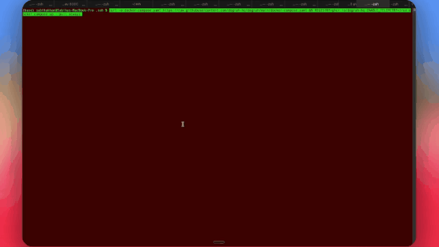
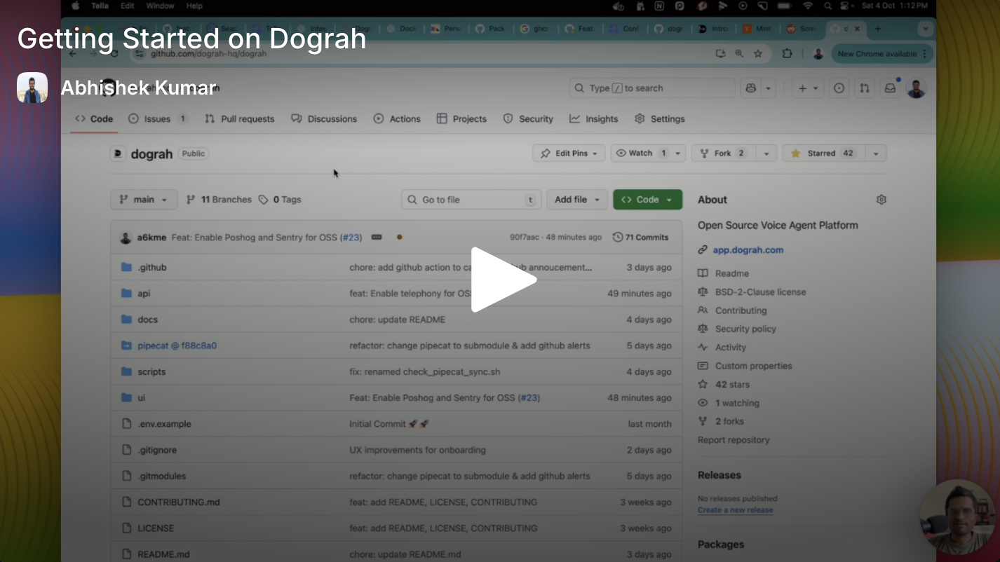

# AICall

**The open-source, self-hostable alternative to Vapi & Retell** — build production voice agents with a visual workflow builder, test them in minutes, and let AI coding assistants help design and edit them through MCP.

<p align="center">
  <a href="https://aicall.rilt.ai">
    
  </a>
  &nbsp;
  <a href="#-get-started">
    
  </a>
  &nbsp;
  <a href="https://github.com/ShoaibAhmedSoomro/riltai-aicall/discussions">
    
  </a>
</p>

<p align="center">
  <a href="https://docs.rilt.ai">📖 Docs</a> &nbsp;·&nbsp;
  <a href="LICENSE">📜 BSD 2-Clause</a> &nbsp;·&nbsp;
  <a href="README.zh-CN.md">🌐 中文</a> &nbsp;·&nbsp;
  <a href="README.ja-JP.md">🌐 日本語</a>
</p>

<p align="center">
  
</p>

- **100% open source**, self-hostable — no vendor lock-in, unlike Vapi or Retell
- **Full control & transparency** — every line of code is open, with flexible LLM / TTS / STT integration


<details>
<summary>📺 Prefer a 2-minute product walkthrough? Click here.</summary>

<div align="center">
  <a href="https://youtu.be/9gPneyf9M9w">
    
  </a>
</div>

</details>

## ⚖️ AICall vs Vapi vs Retell

An honest comparison on the axes that matter most to teams evaluating voice AI platforms.

|  | **AICall** | **Vapi** | **Retell** |
|---|---|---|---|
| **License** | BSD 2-Clause (open source) | Proprietary | Proprietary |
| **Self-hostable** | ✅ Yes — one Docker command | ❌ SaaS only | ❌ SaaS only |
| **Pricing** | Free (self-host) · usage-based (cloud) | Per-minute SaaS | Per-minute SaaS |
| **Bring your own LLM / STT / TTS** | ✅ Any provider, or use AICall's stack | Configurable within their integrations | Configurable within their integrations |
| **Source-level customization** | ✅ Every line is yours to modify | ❌ Closed source | ❌ Closed source |
| **Data residency** | Your infra, your rules | Their cloud | Their cloud |
| **Vendor lock-in** | None | Full | Full |


## 🚀 Get Started

##### Download and setup AICall on your Local Machine

> **Note**
> We collect anonymous usage data to improve the product. You can opt out by setting `ENABLE_TELEMETRY=false` before running the startup script.

> **Note**
> If you wish to run the platform on a remote server instead, checkout our [Documentation](https://docs.rilt.ai/deployment/docker#option-2:-remote-server-deployment)

```bash
curl -o docker-compose.yaml https://raw.githubusercontent.com/ShoaibAhmedSoomro/riltai-aicall/main/docker-compose.yaml && curl -o start_docker.sh https://raw.githubusercontent.com/ShoaibAhmedSoomro/riltai-aicall/main/scripts/start_docker.sh && chmod +x start_docker.sh && ./start_docker.sh
```

> **⚡ Prefer an AI agent to set it up for you?**
> If you use **Claude Code** or **Codex**, install the official [AICall setup skill](https://github.com/ShoaibAhmedSoomro/riltai-aicall-plugins) and let your agent handle installation, configuration, and troubleshooting — it detects your OS, picks the right deploy path, runs AICall's own setup scripts, and verifies the result.
>
> ```text
> # In Claude Code
> /plugin marketplace add ShoaibAhmedSoomro/rilt-plugins
> /plugin install rilt@rilt
> ```
>
> Then start a new session and ask it to _"set up AICall"_ (or run `/rilt-setup`). Codex is supported too — see the [plugin repo](https://github.com/ShoaibAhmedSoomro/riltai-aicall-plugins#install).

> **Note**
> First startup may take 2-3 minutes to download all images. Once running, open http://localhost:3010 to create your first AI voice assistant!
> For common issues and solutions, see 🔧 **[Troubleshooting](docs/getting-started/troubleshooting.mdx)**.

### 🎙️ Your First Voice Bot

1. Open [http://localhost:3010](http://localhost:3010) in your browser.
2. Pick **Inbound** or **Outbound**, name your bot (e.g. _Lead Qualification_), and describe the use case in 5–10 words (e.g. _Screen insurance form submissions for purchase intent_).
3. Click **Test Agent**.
4. Use **Test Audio** to talk to your agent in the browser, or **Test Chat** to iterate faster in text. In Test Chat, you can edit or replay user turns and AICall will regenerate the agent's replies and node transitions from that point.

> 🔑 **No API keys needed.** AICall ships with auto-generated keys and its own LLM / TTS / STT stack. Connect your own keys for LLM, TTS, STT, or Telephony (e.g. Twilio, Vonage, Telnyx) anytime.


## Build Agents with MCP

AICall ships with an MCP server, so coding agents can work directly inside your AICall workspace.

Connect Codex, Claude Code, Cursor, or any MCP client to inspect existing agents, search AICall docs, fetch node schemas, create new workflows, and save draft edits from natural language.

When asking your coding agent to build a voice agent, share a short script for
the use case instead of only a one-line prompt. Include the agent persona, call
flow, rules, objection handling, success criteria, and a sample conversation if
you have one.

See the [MCP guide](https://docs.rilt.ai/integrations/mcp) to connect your assistant.

## Features

### Voice Agent Builder

- Visual workflow builder with start nodes, agent nodes, global instructions, tools, transitions, and end-call outcomes
- Template gallery, a handbook starter, and a prompt-only editor for writing agents without the canvas
- Test Agent panel with **Test Audio** for browser voice testing, **Test Chat** for fast prompt iteration, and an **AI caller simulator** that plays a persona against your agent
- QA node with post-call analysis, knowledge bases, webhooks, embeds, and tool calling (including a **Press Digit** tool for phone menus)

### Voice & Telephony

- Built-in telephony integrations including Twilio, Vonage, Telnyx, Plivo, Vobiz, Cloudonix, and Asterisk ARI
- Human handoff with call transfer on supported telephony providers
- Bring your own LLM, TTS, STT, and telephony providers; store artifacts in bundled MinIO or AWS/S3-compatible storage
- Speech controls: pronunciation overrides, number/date/currency formatting, per-step language, and voice speed
- Audio controls: optional noise suppression, keypad (DTMF) input, IVR menu hang-up, and a backup voice if the primary voice fails

### Operations & Governance

- **Live call monitor** with listen-in, plus alerting on call and agent conditions
- Contacts with do-not-call enforcement, and cost tracking per call
- Data governance: retention, redaction, opt-out, and guardrails
- Organisation roles (admin and member), email verification and password reset

### Developer Experience

- One-command Docker setup for self-hosting
- Python backend and modular provider architecture for customization
- Python and Node SDKs for programmatic agent creation and outbound calls

## Repository Layout

| Path | What lives there |
|---|---|
| `api/` | FastAPI backend, database models and migrations, telephony and pipeline services |
| `ui/` | Next.js 15 / React 19 frontend |
| `sdk/` | Python and TypeScript SDKs (generated clients plus typed helpers) |
| `docs/` | Product and developer documentation (Mintlify) |
| `deploy/` | Helm chart and hosting templates |
| `scripts/` | Local-development and operations helpers |
| `evals/` | Speech-to-text evaluation tooling |
| `logo-rilt/` | Brand logo masters |
| `pipecat/` | Pipecat framework (pinned git submodule) |

## Deployment Options

### Local Development

Refer [Local Setup](https://docs.rilt.ai/contribution/setup)

### Self-Hosted Deployment

For detailed deployment instructions including remote server setup with HTTPS, see our [Docker Deployment Guide](https://docs.rilt.ai/deployment/docker#option-2-remote-server-deployment).

### Cloud Version

Visit [https://www.rilt.ai](https://www.rilt.ai/) for our managed cloud offering.

## 📚Documentation

You can go to [https://docs.rilt.ai](https://docs.rilt.ai/) for our documentation.

## 📦 SDKs

- **Python SDK** — [pypi.org/project/rilt-sdk](https://pypi.org/project/rilt-sdk/)
- **Node SDK** — [npmjs.com/package/@rilt/sdk](https://www.npmjs.com/package/@rilt/sdk)

## 🤝Community & Support


- **GitHub Discussions** — share use cases, ask questions, swap workflow recipes.
- **GitHub Issues** — report bugs or request features.

👉 Join us → [AICall GitHub Discussions](https://github.com/ShoaibAhmedSoomro/riltai-aicall/discussions)

## 🙌 Contributing

We love contributions! AICall is 100% open source and we intend to keep it that way.

### Getting Started

- Fork the repository
- Create your feature branch (git checkout -b feature/AmazingFeature)
- Commit your changes (git commit -m 'Add some AmazingFeature')
- Push to the branch (git push origin feature/AmazingFeature)
- Open a Pull Request

## 📄 License

AICall is licensed under the [BSD 2-Clause License](LICENSE)- the same license as projects that were used in building AICall, ensuring compatibility and freedom to use, modify, and distribute.

## 🏢 About

Built with ❤️ by **AICall**

<br><br><br>

  <p align="center">
    <a href="https://aicall.rilt.ai">☁️ Try Cloud Version</a> |
    <a href="https://github.com/ShoaibAhmedSoomro/riltai-aicall/discussions">💬 Discussions</a>
  </p>
