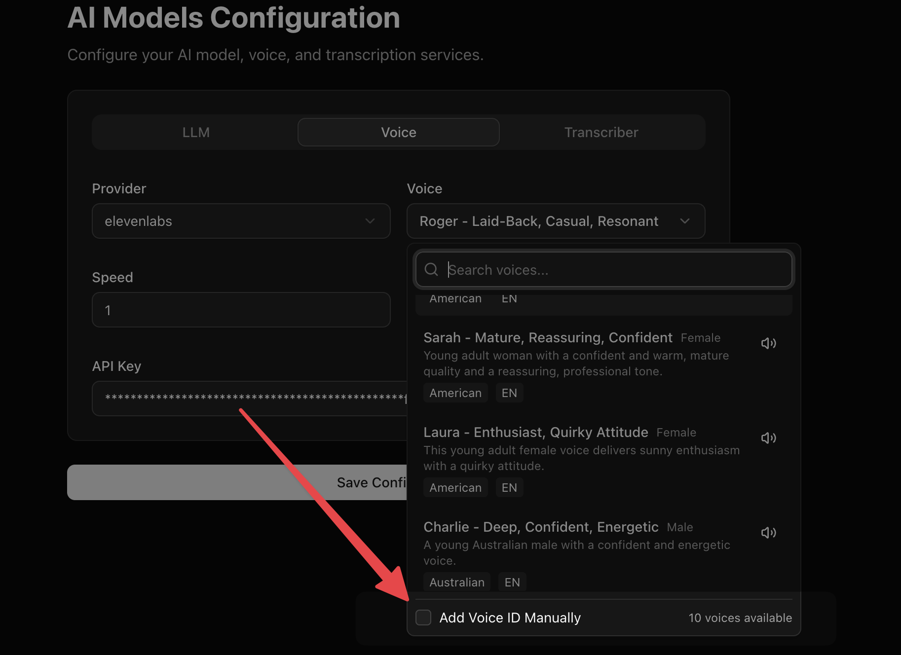

AICall platform supports ElevenLabs, OpenAI, Google, Azure Speech, Deepgram, Cartesia, Smallest AI, MiniMax, Sarvam, Rime, Inworld, Camb.ai, xAI, LMNT, and AICall TTS engines. There are some voices from the providers that we ship by default. You can refer to the providers API documentation to select a voice ID that's most relevant for your language requirement.

<Warning>
Voice providers receive the data needed to synthesize speech, such as generated text, selected voice, model settings, and request metadata. Review the provider's data processing, retention, model training, and regional hosting policies before using sensitive data.
</Warning>

For locally deployed or self-hosted TTS models, AICall also supports Speaches, an OpenAI API-compatible server for speech generation.

If you don't find your favourite voice, you can always add the voice ID manually.

## Voice speed and character

Voice speed is shown for providers that support it, for example ElevenLabs, Cartesia, Google, OpenAI and xAI (OpenAI accepts 0.25 to 4.0 and xAI 0.7 to 1.5; 1.0 is normal). Deepgram, Camb.ai and LMNT do not accept a speed, so the setting is not offered for them.

For ElevenLabs you can also set **stability** (lower is more expressive and more variable), **similarity boost**, **style** and **speaker boost**. Leaving them untouched keeps the voice exactly as it was.

## Pronunciation

If a name, brand or abbreviation is spoken wrongly, open the agent's **Settings → Pronunciation** and add a row: *say this* → *speak it as*. For example `AED` → `dirhams`. Matching is literal (symbols mean themselves) and applies top to bottom. Rules apply before the formatting options below, so an override for `AED` still works when "spell out acronyms" is on.

The **Number & date formatting** options (off by default) rewrite numbers, money, dates, units, phone numbers and email addresses into spoken form before they reach the voice. Turn it on, then place a test call, because it changes how the agent sounds.

Pronunciation is the opposite of the Dictionary: the Dictionary helps the agent *hear* words, Pronunciation changes how it *says* them. Neither applies to speech-to-speech models, which have no separate text-to-speech step.

## A different language in one step

Agent and End Call steps have a **Language** field. When the call enters that step, the agent listens for and speaks that language; a step with no language returns to the agent's own. The transition line is spoken in the new language, and a second step in the same language costs nothing. This works with your own voice provider. It is not available with the managed AICall voice or speech-to-speech models, because they cannot be retargeted mid-call.
