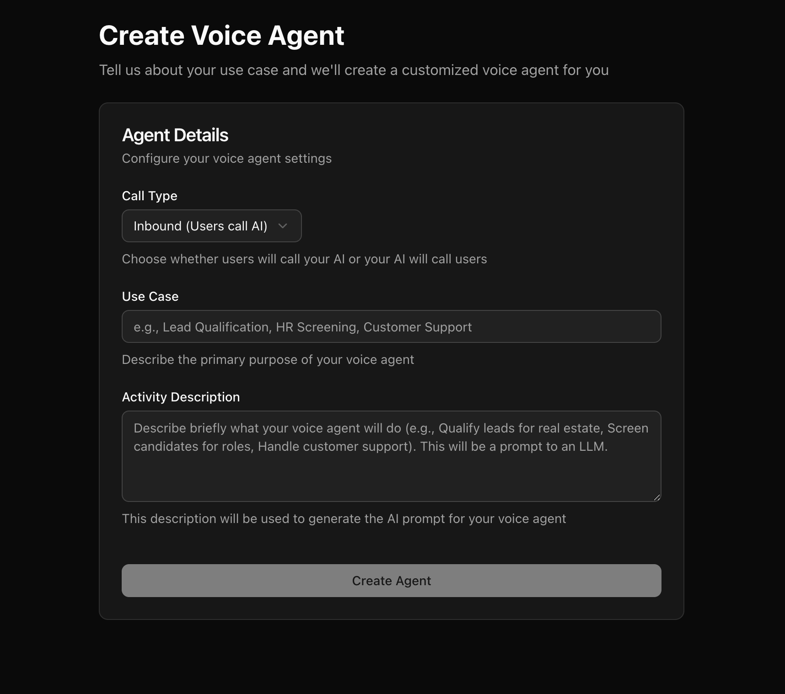

This is the fastest path to a working voice agent. You'll create an agent, get a generated conversation flow, and talk to it in your browser — no phone number, no telephony provider, no configuration.

<iframe
  className="w-full aspect-video rounded-xl"
  src="https://www.youtube.com/embed/sGcOFhH8gxI"
  title="How to Build Your First Voice Agent in AICall"
  allow="accelerometer; autoplay; clipboard-write; encrypted-media; gyroscope; picture-in-picture"
  allowFullScreen
></iframe>

<Note>
Using the hosted platform, go to [aicall.rilt.ai](https://aicall.rilt.ai). Self-hosting locally? Use `http://localhost:3010` instead, and follow [Getting Started](/getting-started) first to get the platform running.
</Note>

## Step 1: Create an agent

Go to [aicall.rilt.ai/workflow](https://aicall.rilt.ai/workflow) and create a new agent.

You'll be asked for:

- **Direction** — Inbound (agent receives calls) or Outbound (agent makes calls). Pick either; it only affects the starting prompt.
- **Use case** — a description of what the agent should do, e.g. *"Book a haircut appointment, ask for preferred date and time, confirm before ending the call."*

This description is sent to an LLM to generate a starting workflow. The more specific you are, the better the generated prompts and pathways will be.

### Start from a template

Don't want to describe the agent from scratch? Open **Create Agent → Start from a template** (or go to `/workflow/templates`). Each template is a complete, working call flow you can use as it is or edit:

| Template | What it does |
| --- | --- |
| **Front Desk Receptionist** | Answers inbound calls, handles simple questions, takes a clear message. |
| **Appointment Booking** | Collects name, reason and preferred time, reads the booking back to confirm. |
| **Customer Support Triage** | Finds the problem, walks through common fixes, and records a ticket summary when it cannot solve it. |
| **Lead Qualification** | Asks the questions that decide whether an enquiry is worth a salesperson's time. |
| **Outbound Sales Intro Call** | Asks permission, asks two discovery questions, and books a follow-up. |

Pick one, check the steps in the preview, give your copy a name and click **Use this template**. You land in the editor with your own copy; the template itself is never changed. Templates use the [Prompt Handbook](/voice-agent/prompt-handbook) as their Global prompt and contain no tools, documents or recordings, so there is nothing to reconnect. Replace the sample business name in the prompts with yours, then continue at Step 3.

<Tip>
A **Blank Canvas** agent starts as a Start Call node joined to an End Call node and opens in a prompt-only editor: a greeting and one prompt. It is the quickest way to try a single idea.
</Tip>

## Step 2: Land in the workflow editor

After generation, you're dropped into the [Voice Agent Builder](/voice-agent/introduction) with a graph already built for you — typically a **Start Call** node, one or more **Agent** nodes with prompts for your use case, and an **End Call** node, connected by pathways.

You don't need to understand the full [graph model](/voice-agent/introduction#the-graph-model) yet — the generated agent works out of the box. You can come back and customize prompts once you've heard it talk.

## Step 3: Talk to it with a Web Call

In the agent editor, start a **Web Call**. This runs the full pipeline — speech-to-text, LLM, text-to-speech — straight from your browser microphone, exactly like a real phone call would, just without a phone number.

While the call is active, you can watch:

- The **live transcript** as the conversation happens
- **Node transitions** as the agent moves through the graph
- Any **tool calls** the agent makes

Talk to it like a real caller would. Try to get it off-script — say something unexpected — and see how it responds.

## Step 4: Iterate

Didn't go the way you wanted? Open the node whose behavior you want to change and edit its prompt directly. Save, then start a new Web Call to hear the change immediately. No redeploy, no restart.

Common first tweaks:

- Adjust tone or wording in an **Agent** node's prompt
- Add shared instructions (tone, objection handling) to the [**Global**](/voice-agent/global) node
- Add a [**Webhook**](/voice-agent/webhook) node to send call results somewhere once you're happy with the flow

## Next Steps

You have a working agent that runs entirely in the browser. From here:

- **Take real calls** — connect a [telephony provider](/integrations/telephony/overview) and trigger calls via [API Trigger](/voice-agent/api-trigger) or inbound routing.
- **Learn the graph model in depth** — see [Voice Agent Builder](/voice-agent/introduction) for all node types and how pathways work.
- **Give it tools** — let the agent call external APIs or transfer calls with [Tools](/voice-agent/tools/introduction).
- **Embed it on a website** — skip telephony entirely and let website visitors talk to the agent via [Add to Website](/voice-agent/add-to-website).
